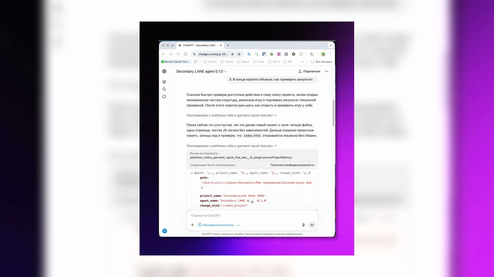
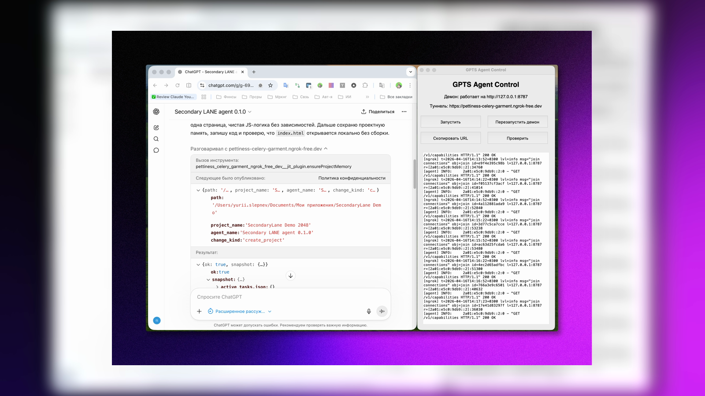

# Second Lane

Built by **Yurii Slepnev**.

Official links:
- Telegram: https://t.me/yurii_yurii86
- YouTube: https://youtube.com/@yurii_yurii86
- Instagram: https://instagram.com/yurii_yurii86

Copyright (c) 2026 Yurii Slepnev. Licensed under **Apache-2.0**.

**Language:** [Русская версия](#ru) · [English version](#en)

---

## RU

**Преврати ChatGPT в реального coding-agent на своей машине. Локально. Через GPT Actions.**

Second Lane даёт ChatGPT реальные действия на твоём компьютере: inspect проекта, patch кода, запуск команд, запуск тестов, старт сервисов, проверку результата и память проекта между сессиями.

**Second Lane особенно силён, когда Claude Code, Codex или другой AI coding-agent упирается в лимиты, теряет контекст или просто перестаёт быть удобным.**

### Демо

Прежде чем читать инструкцию по установке, посмотри, как работает macOS-версия:

<p align="center">
  
</p>

### Скриншоты

<p align="center">
  
  
</p>

<p align="center">
  <sub><strong>Рабочий процесс через чат</strong> · Задача двигается внутри обычного интерфейса ChatGPT</sub>
  <br>
  <sub><strong>Панель управления и локальный рантайм</strong> · ChatGPT с одной стороны, локальный исполнительный слой с другой</sub>
</p>

### Зачем это людям

Second Lane нужен тем, кому нравится ChatGPT, но кто хочет не просто советы в чате, а реальную работу с проектом.

- **Без отдельной возни с API-ключами.** Если у тебя уже есть ChatGPT с поддержкой GPTs и Actions, не нужно строить отдельную схему оплаты моделей.
- **Локальный по своей природе.** Second Lane работает на твоей машине и видит только те папки, которые ты сам разрешил.
- **Можно работать даже с телефона.** Через `ngrok` твой GPT может достучаться до компьютера из приложения ChatGPT.
- **Работает с разными языками и стеками.** Python, Node, Go, Rust, Java, скрипты, монорепы — если на компьютере можно запустить нужную команду, ChatGPT сможет этим управлять.
- **Интерфейс — привычный ChatGPT, а не CLI.** То есть обычный чат, а не инструмент, где всё крутится вокруг терминала.

### Только официальные возможности ChatGPT

Second Lane работает через обычный workflow ChatGPT:

- Custom GPTs
- Actions
- instructions
- knowledge files

То есть:

- **без скрытых API-трюков** — ты подключаешь GPT к своему локальному серверу через стандартные Actions;
- **без серых схем и чужих ключей** — используется твой собственный аккаунт ChatGPT и уже существующие возможности продукта;
- **без неофициального слоя доступа** — Second Lane не заменяет ChatGPT, а добавляет к нему локальный исполнительный слой на твоей машине.

### Что это такое

Second Lane — это локальный сервер, который подключает ChatGPT к твоему проекту через GPT Actions.

Он даёт ChatGPT возможность:

- **читать и искать** файлы проекта;
- **править код** с автоматическим откатом, если проверка не прошла;
- **запускать тесты** с автоопределением (`pytest`, `npm test`, `make test`);
- **поднимать сервисы** и делать smoke-check;
- **выполнять команды** в рабочей папке;
- **хранить память проекта** между сессиями через `.ai_context/`.

```text
Твоя машина                         ChatGPT
┌─────────────────┐    ngrok     ┌──────────────┐
│   Second Lane   │◄────────────►│  GPT Actions │
│ localhost:8787  │    tunnel    │  Custom GPT  │
└─────────────────┘              └──────────────┘
```

### Самые сильные фишки Second Lane

Это не просто “чат, который может читать файлы”. Самые сильные вещи здесь такие:

- **продолжение после лимитов Claude Code / Codex** — работа не умирает вместе с лимитом другого агента;
- **реальные действия на локальной машине через ChatGPT** — inspect, patch, run, verify;
- **safe patch → verify → rollback** — правки можно делать не вслепую, а через проверяемый workflow;
- **project memory между сессиями** — `.ai_context/` позволяет не терять handoff и состояние проекта;
- **можно работать даже не из IDE** — в том числе через обычный ChatGPT-интерфейс и ChatGPT app;
- **local-first безопасность** — доступ только к разрешённым папкам и защищённым маршрутам.

### Почему это ощущается иначе

Большинство инструментов в этом классе — terminal-first и API-key-first.

Second Lane построен вокруг другой идеи:

- использовать **ChatGPT как интерфейс**;
- выполнять работу **локально на своей машине**;
- держать проект **рядом с машиной, а не в удалённом SaaS-слое**;
- сделать remote-control сценарий достаточно простым, чтобы им можно было пользоваться даже не из IDE;
- дать второй рабочий контур, когда первый агент упёрся в лимит, умер или потерял контекст.

### Где это особенно сильно

- добить багфикс после лимита Claude Code;
- продолжить задачу в ChatGPT с того места, где остановился Codex;
- быстро прогнать inspect, patch, test и smoke-check в одном контуре;
- оставить структурированный handoff, чтобы не потерять контекст между сессиями;
- использовать ChatGPT как реальный execution layer, а не только как чат;
- работать со своим проектом даже с телефона через ChatGPT app.

### Быстрое сравнение

| Ситуация | Claude Code / Codex | Second Lane |
| --- | --- | --- |
| Пока лимиты и сессия в порядке | Отлично | Не обязан быть первым выбором |
| Агент упёрся в лимит | Работа стопорится | Можно продолжить в ChatGPT |
| Нужно быстро подхватить задачу в другом интерфейсе | Не всегда удобно | Это основной сценарий |
| Нужны реальные действия на своей машине через ChatGPT | Обычно не про это | Это и есть суть |
| Нужна память проекта между сессиями | Часто частично или через чат | Встроено через `.ai_context/` |
| Нужен привычный интерфейс вместо CLI | Не основной фокус | ChatGPT — это и есть интерфейс |
| Нужен доступ из ChatGPT app / с телефона | Обычно нет | Да |

### Пример живого сценария

Например, ты делал багфикс в Claude Code:

1. Агент уже нашёл подозрительное место в коде.
2. Потом упёрся в лимит до завершения.
3. Ты открываешь ChatGPT.
4. GPT через Second Lane делает `inspectProject`, читает нужные файлы, вносит правку, запускает тест или команду и проверяет результат.
5. Работа не умирает вместе с лимитом.

### Что уже подтверждено сейчас

Подтверждённый рабочий контур:

- daemon поднимается локально на `127.0.0.1:8787`;
- `ngrok` публикует текущий daemon наружу;
- `openapi.gpts.yaml` импортируется в GPT Actions после того, как панель подставила живой URL туннеля;
- GPT может вызывать curated actions для работы с проектом;
- `.ai_context/` хранит долговечную память между сессиями;
- локальные verify и smoke-check сценарии проходят в текущем проекте.

### GPT schema

В проекте рабочей схемой для GPT Actions считается одна схема:

- `openapi.gpts.yaml` — curated compact schema для GPT Actions.

Именно её нужно импортировать в GPT Actions после строки `Туннель активен` в панели Second Lane Control.

Если импортировать файл прямо из GitHub до запуска панели, внутри будет учебный адрес `your-domain.ngrok-free.dev`. GPT запомнит этот адрес, и Actions будут долго ждать ответ от несуществующего сервера.

### Самые сильные workflow actions в GPT schema

Текущий compact action-set специально включает более сильные операции:

- `safePatchAndVerifyProjectFile`
- `applyPatch`
- `multiFilePatchAndVerify`
- `runTest`
- `analyzeProjectBuildFailure`
- `runProjectServiceAndSmokeCheck`

И сознательно **не включает** слабые или лишние GPT-facing слоты вроде browser-open и размытых GUI-actions.

### Что реально делает GPT через этот runtime

- смотрит структуру проекта;
- ищет нужные файлы и фрагменты;
- читает код;
- правит файлы точечно или координированно через несколько файлов;
- запускает команды и тесты;
- поднимает сервис и проверяет, что он действительно стартовал;
- анализирует ошибки сборки и запуска;
- оставляет handoff для следующей сессии.

### Быстрый запуск (macOS)

1. Скачай репозиторий как ZIP.
2. Распакуй ZIP.
3. Открой папку.
4. Дважды нажми `Установить Second Lane.command`.
5. Следуй окну установщика.

Важно: ничего не вводи в Terminal вручную. Если Terminal открылся, просто смотри на подсказки установщика.

Если Mac блокирует запуск, нажми правой кнопкой на `Установить Second Lane.command` и выбери `Открыть`.

### Как подключить GPT

1. Запусти панель Second Lane Control.
2. Дождись строки `Туннель активен`.
3. Убедись, что в журнале написано: URL обновлён в `openapi.gpts.yaml`.
4. Импортируй `openapi.gpts.yaml` в GPT Actions.
5. Укажи bearer token из `.env`.
6. Вставь `gpts/system_instructions.txt` в instructions GPT.
7. Загрузи `gpts/knowledge/` в knowledge GPT.
8. Проверь первые вызовы `getCapabilities`, `inspectProject`, `runTest`.

### Структура проекта

```text
app/main.py              # FastAPI server — все GPT-facing API routes
app/core/                # config, security, utils, project memory, providers
gpts/                    # system instructions + knowledge pack
gpts_agent_control.py    # control panel (daemon + ngrok tunnel)
openapi.gpts.yaml        # curated compact OpenAPI schema for GPT Actions
.env.example             # шаблон конфигурации
```

### Безопасность

- все маршруты защищены bearer token auth;
- доступ к файлам ограничен `WORKSPACE_ROOTS`;
- SSH ограничен allowlist-ом host/CIDR и использует `known_hosts` + `RejectPolicy`;
- слабые токены отклоняются на старте runtime;
- ключевые действия пишутся в SQLite audit/state layer.

### Требования

- Python `3.13`;
- `ngrok`;
- ChatGPT план с доступом к GPTs + Actions;
- локальная машина, на которой ты реально держишь проект и разрешённые workspace roots.

### Технические ограничения

- рабочий локальный путь сейчас ориентирован на Python `3.13`;
- локальная установка на Python `3.14` не считается поддержанной для этого набора зависимостей;
- основной repo-local путь окружения — `.venv`;
- все маршруты защищены bearer auth;
- доступ к файлам ограничен `WORKSPACE_ROOTS`.

---

## EN

**Turn ChatGPT into a real coding agent on your machine. Local. Through GPT Actions.**

Second Lane gives ChatGPT real actions on your machine: inspect code, patch files, run tests, start services, verify results, and keep project memory between sessions.

**Second Lane is especially strong when Claude Code, Codex, or another AI coding agent hits limits, loses context, or simply stops being convenient.**

### Demo

See the macOS version in action before reading the setup guide:

<p align="center">
  
</p>

### Screenshots

<p align="center">
  
  
</p>

<p align="center">
  <sub><strong>Chat-driven workflow</strong> · The task moves inside the normal ChatGPT interface</sub>
  <br>
  <sub><strong>Control panel and local runtime</strong> · ChatGPT on one side, local execution layer on the other</sub>
</p>

### Why People Use It

Second Lane is for people who already like ChatGPT, but want it to do real work on a real project.

- **No extra API-key workflow.** If you already use ChatGPT with GPTs and Actions, you do not need a separate model-billing-and-CLI ritual just to keep another coding agent alive.
- **Local by design.** Second Lane runs on your machine and only works inside folders you explicitly allow.
- **Works even from your phone.** Through `ngrok`, your GPT can reach your machine from the ChatGPT app.
- **Works across languages and stacks.** Python, Node, Go, Rust, Java, scripts, monorepos — if your machine can run the right command, ChatGPT can operate that project.
- **The interface is familiar ChatGPT, not a CLI.** You stay in the normal ChatGPT workflow instead of moving everything into a terminal-first tool.

### Only Official ChatGPT Features

Second Lane works through the standard ChatGPT workflow:

- Custom GPTs
- Actions
- instructions
- knowledge files

That means:

- **no hidden API tricks** — you connect a GPT to your local server through standard Actions;
- **no gray schemes and no borrowed keys** — you use your own ChatGPT account and existing product features;
- **no unofficial access layer** — Second Lane does not replace ChatGPT; it adds a local execution layer on your machine.

### What It Is

Second Lane is a local server that connects ChatGPT to your project through GPT Actions.

It lets ChatGPT:

- **read and search** your project files;
- **patch code** with automatic rollback when verification fails;
- **run tests** with auto-detection (`pytest`, `npm test`, `make test`);
- **start services** and run smoke checks;
- **execute commands** in the workspace;
- **keep durable project memory** across sessions through `.ai_context/`.

```text
Your machine                          ChatGPT
┌─────────────────┐    ngrok     ┌──────────────┐
│  Second Lane    │◄────────────►│  GPT Actions │
│  localhost:8787 │    tunnel    │  Custom GPT  │
└─────────────────┘              └──────────────┘
```

### The Most Powerful Things About Second Lane

This is not just “chat that can read files.” The strongest parts are:

- **continue after Claude Code / Codex limits** — the task does not die when another agent hits a cap;
- **real local execution through ChatGPT** — inspect, patch, run, verify;
- **safe patch → verify → rollback** — changes can go through a real workflow instead of blind edits;
- **project memory across sessions** — `.ai_context/` preserves handoff and continuity;
- **works even outside an IDE-first flow** — including the normal ChatGPT interface and ChatGPT app;
- **local-first security** — only allowed folders and protected routes are exposed.

### Why It Feels Different

Most tools in this category are terminal-first and API-key-first.

Second Lane is built around a different idea:

- use **ChatGPT as the interface**;
- run the work **locally on your own machine**;
- keep the project **close to the machine, not in a hosted SaaS layer**;
- make the remote-control path simple enough to use even outside a full IDE workflow;
- provide a second execution lane when the first agent hits limits, dies, or loses context.

### Where It Is Especially Strong

- finish a bugfix after Claude Code hits its limit;
- continue a task in ChatGPT from the point where Codex stopped;
- run inspect, patch, test, and smoke-check in one lane;
- leave structured handoff so context survives across sessions;
- use ChatGPT as a real execution layer, not just a chat box;
- work with your local project even from the ChatGPT app on your phone.

### Quick Comparison

| Situation | Claude Code / Codex | Second Lane |
| --- | --- | --- |
| Limits and session are healthy | Excellent | Not necessarily the first choice |
| The agent hits a cap | Work stalls | You can continue in ChatGPT |
| You need to pick up the task from another interface fast | Not always convenient | This is the primary use case |
| You want real actions on your machine through ChatGPT | Usually not the point | That is the whole point |
| You need project memory across sessions | Often partial or chat-bound | Built in through `.ai_context/` |
| You want a familiar interface instead of CLI-first flow | Not the main angle | ChatGPT is the interface |
| You want access from the ChatGPT app / from your phone | Usually no | Yes |

### Real-World Scenario

Imagine you were fixing a bug in Claude Code:

1. The agent already found the likely problem area.
2. Then it hit a limit before the task was complete.
3. You open ChatGPT.
4. GPT uses Second Lane to call `inspectProject`, read files, apply a change, run a test or command, and verify the result.
5. The work does not die with the limit.

### What Is Confirmed Working Today

Confirmed working path:

- the daemon runs locally on `127.0.0.1:8787`;
- `ngrok` exposes the current daemon over the internet;
- `openapi.gpts.yaml` can be imported into GPT Actions;
- GPT can call curated actions against the project;
- `.ai_context/` stores durable project memory across sessions;
- the local verify and smoke-check paths pass in the current project.

### GPT Schema

This project uses one working schema for GPT Actions:

- `openapi.gpts.yaml` — the curated compact schema for GPT Actions.

This is the schema that should be imported into GPT Actions and kept aligned with the current GPT-facing action set.

### Strong Workflow Actions Exposed To GPT

The current compact GPT schema deliberately exposes stronger workflow operations such as:

- `safePatchAndVerifyProjectFile`
- `applyPatch`
- `multiFilePatchAndVerify`
- `runTest`
- `analyzeProjectBuildFailure`
- `runProjectServiceAndSmokeCheck`

And it deliberately avoids weaker or noisier GPT-facing browser/GUI convenience slots.

### What GPT Can Actually Do Through It

- inspect a project;
- find relevant files and code fragments;
- read code;
- patch one file or coordinate changes across multiple files;
- run commands and tests;
- start a service and verify it really started;
- analyze build and runtime failures;
- leave structured handoff for the next session.

### Quick Start (macOS)

1. Download this repository as a ZIP.
2. Unzip it.
3. Open the folder.
4. Double-click `Установить Second Lane.command`.
5. Follow the installer window.

Important: do not type commands into Terminal manually. If Terminal opens, just watch it and follow the installer prompts.

If macOS blocks the file, right-click `Установить Second Lane.command` and choose `Open`.

### Connect Your GPT

1. Import `openapi.gpts.yaml` into GPT Actions.
2. Set the bearer token from `.env`.
3. Paste `gpts/system_instructions.txt` into your GPT instructions.
4. Upload `gpts/knowledge/` into GPT knowledge.
5. Verify the first `getCapabilities`, `inspectProject`, and `runTest` calls.

### Project Structure

```text
app/main.py              # FastAPI server — all GPT-facing API routes
app/core/                # config, security, utils, project memory, providers
gpts/                    # system instructions + knowledge pack
gpts_agent_control.py    # control panel (daemon + ngrok tunnel)
openapi.gpts.yaml        # curated compact schema for GPT Actions
.env.example             # configuration template
```

### Security

- all routes require bearer token authentication;
- file access is restricted to `WORKSPACE_ROOTS`;
- SSH is restricted to allowlisted hosts/CIDRs with `known_hosts` + `RejectPolicy`;
- weak tokens are rejected at startup;
- key actions are recorded in the SQLite audit/state layer.

### Requirements

- Python `3.13`
- `ngrok`
- a ChatGPT plan with GPTs + Actions support
- a local machine that actually holds the project and allowed workspace roots

### License

This project is licensed under **Apache License 2.0**.

See:

- `LICENSE`
- `NOTICE`

### Attribution

If you redistribute this project or derivative works, preserve:

- `LICENSE`
- `NOTICE`
- copyright notices in the source tree
- attribution to **Yurii Slepnev** where Apache-2.0 and NOTICE require it

Official author links:
- Telegram: https://t.me/yurii_yurii86
- YouTube: https://youtube.com/@yurii_yurii86
- Instagram: https://instagram.com/yurii_yurii86
